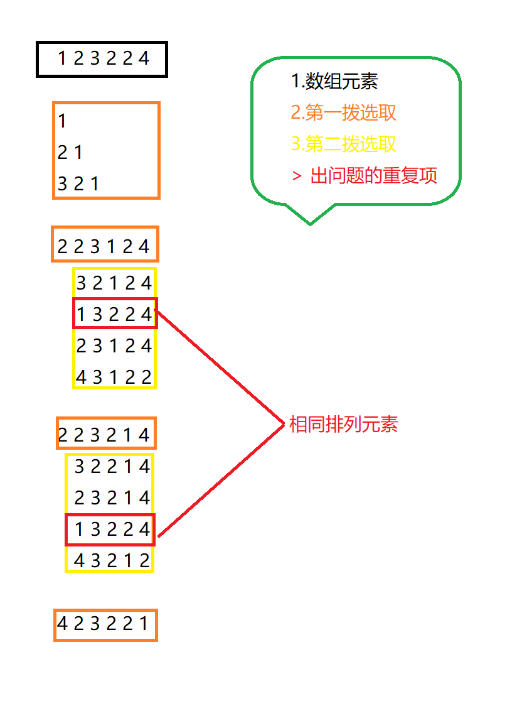

# Algorithm Learn

> 回溯问题
> 
> LG: 12 | 回溯：我把回溯总结成一个公式，回溯题一出就用它


### 排列
```text
例 3：排列 无重复元素
【题目】给定无重复元素的数组，输出这个数组所有的排列。

输入：A = [1, 2]

输出：[[1, 2], [2, 1]]

解释：两个元素的数组的排列有两种。
```

```text
例 5：排列 有重复元素
【题目】给定一个可包含重复数字的数组 A ，按任意顺序返回所有不重复的全排列。

输入：A[] = [1, 1, 2]

输出：[[1,1,2], [1,2,1], [2,1,1]]

解释：[A[0], A[1], A[2]] 与 [A[1], A[0], A[2]] 是一个重复的排列，不能放在其中。其他重复的排列也类似。因此最终只有 3 个数组有排列。
```
* 怎样处理排列相同的情况
> 与组合不一样，这里主要关注重复元素的选取, 如果按照数组中没有重复元素的方法，将会出现以下问题
> 


> 只要前面存在相同的元素，则不需要再对后面的相同元素进行交换， 这样就可以保证不会出现排列重复的情况
