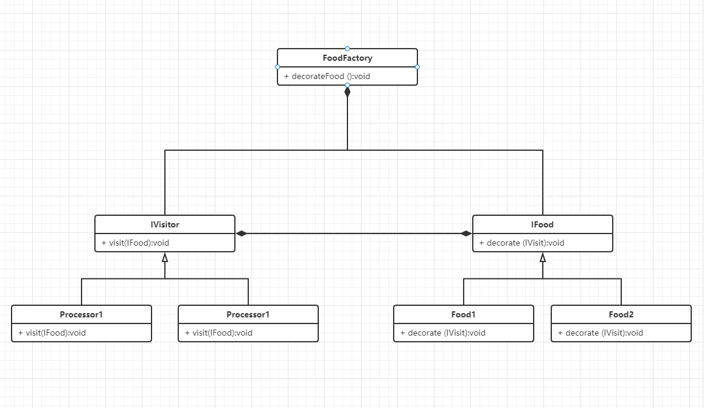

# DP

> Visitor
> 访问者模式

> Classic Implement 经典实现
```text

```

> Code

```java
import java.util.ArrayList;
public interface IVisitor{
    void visit(IFood food);
}
public class Processor1 implements IVisitor{
    public void visit(IFood food){
        System.out.println("Deal with food using processor1");
    }
}
public class Processor2 implements IVisitor{
    public void visit(IFood food){
        System.out.println("Deal with food using processor2");
    }
}

public interface IFood{
    void decorate(IVisitor visitor);
}
public class Food1 implements IFood{
    public void decorate(IVisitor visitor){
        visitor.visit(this);
    }
}
public class Food2 implements IFood{
    public void decorate(IVisitor visitor){
        visitor.visit(this);
    }
}

public class FoodFactory {
    List<IFood> list = new ArrayList<>();

    public void decorateFood() {
        // Prepare the food that need to be decorated
        list.add(new Food1());
        list.add(new Food2());

        // Create the processor that need to be used to food
        IVisitor processor1 = new Processor1();
        IVisitor processor2 = new Processor2();
        
        // Deal with the food using the processor
        for (IFood f:list) {
            f.decorate(processor1);
            f.decorate(processor2);
        }
    }
}

public class Program {
    public static void main(String[] args) {
        new FoodFactory().decorateFood();
    }
}
```