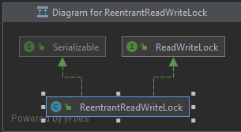
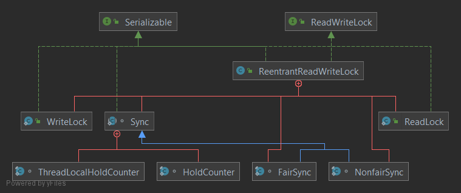

# 读写锁分析

## Java lib 分析
> 简单代码实例 
> src/nori/programming/java/lib/lock/ReadWriteLock.md

#### ReentrantReadWriteLock
* 基本架构
```java
// 读写锁
public class ReentrantReadWriteLock implements ReadWriteLock, java.io.Serializable {}

// 其中ReadWriteLock接口主要提供了对外获取 读锁 和 写锁的方法
```


* 内部实现架构
```java
主要的类结构
```


* ReentrantReadWriteLock 

* WriteLock

* LeadLock

* Sync

* FairSync

* NonfairSync

* HoldCounter

* ThreadLocalHoldCounter

  


