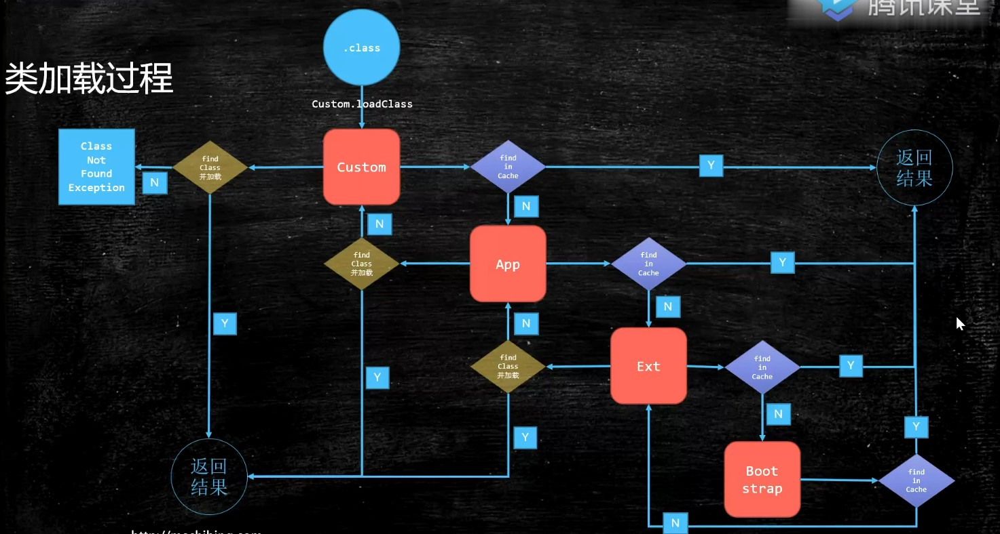

# Java

> 类加载器

* 类加载过程

  
* 自定义加载器
```java
    // 继承 ClassLoader

    // 1.
    // 重写findClass()

    // 2.
    // 打破双亲委派模型
    // 重写loadClass()
```

* Q
```java
    // 
```

```shell
    java -XX:+PrintCommandLineFlags -version
    -XX:InitialHeapSize=264601472 -XX:MaxHeapSize=4233623552 -XX:+PrintCommandLineFlags -XX:+UseCompressedClassPointers -XX:+UseCompressedOops -XX:-UseLargePagesIndividualAllocation -XX:+UseParallelGC
    java version "1.8.0_281"
    Java(TM) SE Runtime Environment (build 1.8.0_281-b09)
    Java HotSpot(TM) 64-Bit Server VM (build 25.281-b09, mixed mode)
    
    
    oops : Ordinary Object Pointers
```

> 多线程锁
* synchronized的底层实现
```text
JDK1.5之前 使用重量级 - OS

之后 使用锁升级概念
    sync (Object)
    markword 记录这个线程ID(偏向锁)
    if 线程争用 
        升级为 自旋锁
        if 自旋 10 次以后S

自旋锁使用场景：
    执行时间短(加锁代码)， 线程数少；
系统锁 - OS使用场景：   
    执行时间长；线程数多；    
    
Note:
    1.synchronized(Object), 锁的对象不能用常量如，String, 或基本数据类型的包装类Integer, Long
    2.自旋锁：
        只消耗CPU
        EG：
            while(){}
    3.系统锁 - OS
        不消耗CPU        
```

> volatile
```java
    保证线程可见性
        缓存一致性协议
    禁止指令重排序 
        可以解决双重检查问题
        
    正常初始化:
        先申请空间
        变量初始化
        将空间指向变量
```

> IO
```java
操作系统的SendFile()
	// 普通拷贝（磁盘->内核缓冲区->用户缓冲区->Socket缓冲区->网卡缓冲区）
	// 实现零拷贝技术（磁盘->内核缓冲区->Socket缓冲区->网卡缓冲区）
	Java.nio.channels.FileChannel.transferTo()
```