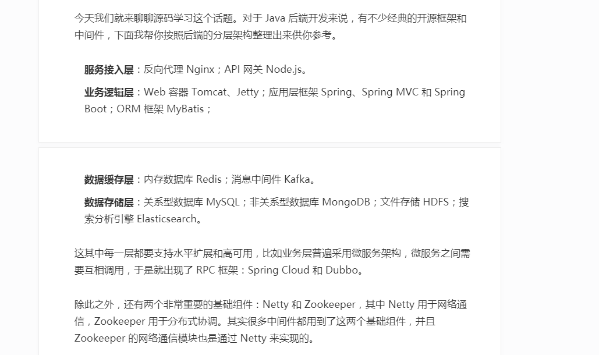

# 2021 Plan of Learning

> Server
```text
    Object: 
        Tomcat
        Jetty 
        
    1.Basic function learning
    2.Basic module learning
    3.Debug from code
    4.Analyse the core code
    5.Learning to use its basic thinking and ways
```

> Framework
```text
    Spring
```

> Back-end Map
> 



> 安排
* 27/04/2021-31/05
    * Java 并发 API， 知识
    * 了解Spring 基本使用
    
* 01/06/2021 -   
    * Java 网络 API， 知识
    * 了解MySQL 基本使用
